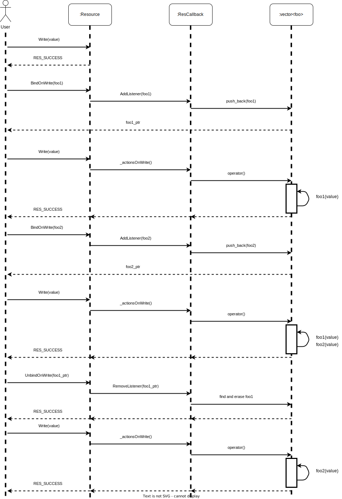
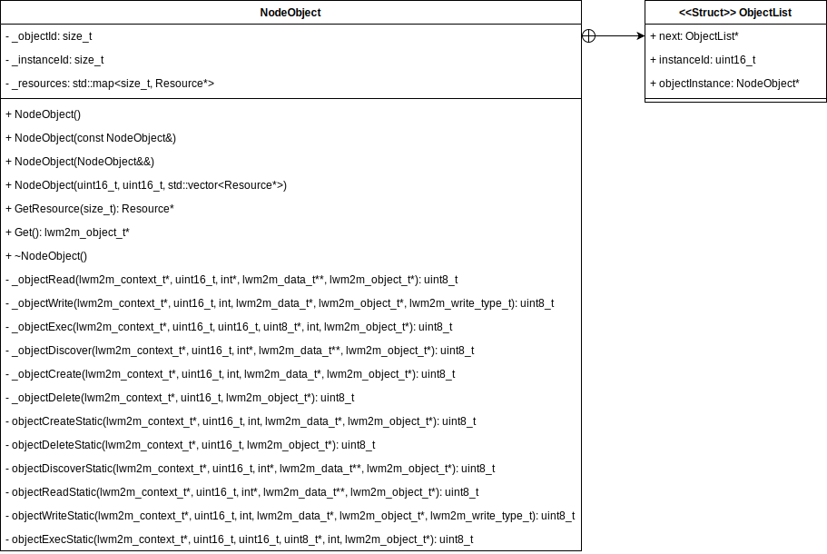

# Library Node Client

## Introduction

The purpose of this library is to let user configure an LwM2M client with the objets and resources described in the uCIFI data model. 

This library is a portage of the Wakaama LwM2M client code into a more object oriented LwM2M client version.

## Library design

In this library, there are three main C++ classes:

1. Resource => corresponds to a resource described in uCIFI
2. NodeObject => corresponds to an object described in uCIFI
3. NodeClient => LwM2M client

## Resource class

### Constructors:

1. Default
2. Copy
3. Move
4. Specifying value, permitted operations, name, units and ID

### Attributes:

1. _value, value stored by the resource
2. _resourceOp, operation permitted on the resource (Read/Write/Execute)
3. _name, resource name
4. _unit, resource unit (a list of units is found in the enum class ResourceOp in the [./resource.h](./resource.h) file)
5. _errorCode, similar to POSIX errno, allows tracking error codes raised from incorrect resource manipulation
6. _id, resource index
7. actionsOnWrite, object registering callbacks that will be triggered upon writing to the resource
8. actionsOnRead, object registering callbacks that will be triggered upon reading the resource
8. actionsOnExec, object registering callbacks that will be triggered upon executing the resource

### Getters:

1. Check if the Resource is empty or not
2. Type of value stored in Resource
3. Operation permitted on Resource
4. Name
5. Unit
6. ID
7. Error code
8. Value of the Resource

### Setter:

1. Value of Resource

### Functionalities:

1. Read, Write and Exec functions. Used in NodeObject Read, Write or Execute callback for specific Resources.
2. BindOnWrite, BindOnRead and BindOnExec functions. Used to register a new callback function to be triggered when Read, Write, or Exec Resource functions are called.
3. UnbindOnWrite, UnbindOnRead and UnbindOnExec functions. Used to unregister a callback previously registered. The Bind functions return a shared pointer to the bound callback. The unbind function takes this shared pointer as argument to find the callback to unregister.

### ResCallback object:

Here's an example on how to use ResCallback objects:



### Error code handling:

An error code allows the user to know if they are handling a Resource instance incorrectly.

### Error code are listed as 5 macros:

1. RES_SUCCESS, everything went right
2. BAD_EXPECTED_ACCESS, the resource object is manipulated, with an operation not matching it's _resourceOp attribute
3. VALUE_IS_EMPTY, the resource doesn't have a defined _value
4. VALUE_TYPE_NOT_CORRESPONDING, the template argument does not match the _value type
5. NO_CALLBACK_OBJECT, it is not permitted to unbind function if there's no ResCallback instance in the resource

### Resource architecture


## NodeObject class

### Constructors:

1. Default
2. Copy
3. Move
4. Specifying _objectId, _instanceId and the vector of Resources. When creating a NodeObject instance, Resources are stored in the NodeObject as a std::map using each Resource's ID as key.  

### Attributes:

1. _objectId, unique identifier for each type of object described in the uCIFI standard
2. _instanceId, unique identifier of object instance
3. _resources, collection of Resource instance mapped to their own ID.

### Getter:

It's possible to get a specific NodeObject Resource instance with the method GetResource specifying the ID of the Resource.

### Callbacks:

1. Read, reads all the values of each resource requested by the server.
2. Write, writes all the values of each resource requested by the server.
3. Execute, executes all the actions of each resource requested by the server.
4. Discover, configures all the resources of an object on the server.
5. Create, creates a new instance of the object.
6. Delete, deletes an instance of the object.

Each callback is duplicated in a static version. This is necessary because the liblwm2m.h needs to bind callback pointers to specific fields of used structure, but C++ doesn't allow instance method pointer to be assigned to such fields. Instead, the static callback is always called and responsible for calling the correct instance callback method.

### Callback implemented can handle Resource with those types:

1. int
2. bool
3. float
4. double
5. string

### Multiple instance Resource:

Certain Resources allow multiple instances for the same Resource. In this library, the user only needs to define a Resource with ```map<size_t, Resource *>``` value and instanciate the multiple Resources in it.

### NodeObject architecture



## NodeClient class

### Constructors:

1. Default
2. Copy
3. Move
4. Specifying only the vectors of instanciated objects 
5. Specifying NodeObjects vector, internet interface, server URL, server PORT, client key, client endpoint name, client identity

### Attributes:

1. _objects, uCIFI NodeObjects instanciated on the client
2. _eth, internet interface
3. _url, server URL
4. _port, server port
5. _clientKey, PSK shared key
6. _endpointName
7. _clientIdentity, PSK client identity

### Setters:

1. Client's NodeObjects
2. Network interface
3. Server URL
4. Server port
5. Client's shared key
6. Client endpoint name
7. Client PSK identity

### Methods:

1. InitNetwork, set default internet interface for the client if not set at construction or via setter
2. StartClient, start connection between client and server

### NodeClient architecture:


## Library Architecture


## Library usage

The [./objects_definition.cpp](./objects_definition.cpp) defines a function ```std::vector<NodeObject *> *initializeObjects()```. The user is free to instanciate any uCIFI object he wants.

### Steps to instanciate an object

1. Instantiate dynamically all Resource instances with their characteristics.

Time synchronisation example:

```{C}
Resource *ntpServerAddress = new Resource(std::string(""), ResourceOp::RES_RDWR, "NTP server address", Units::NA, 1);
Resource *backupNtpServerAddress = new Resource(std::string(""), ResourceOp::RES_RDWR, "Backup NTP server address", Units::NA, 2);
Resource *ntpPeriod = new Resource(std::string(""), ResourceOp::RES_RDWR, "NTP period", Units::NA, 3);
Resource *lastTimeSync = new Resource(0, ResourceOp::RES_RD, "Last time sync", Units::HOURS, 4);
Resource *timeSyncError = new Resource(false, ResourceOp::RES_RD, "Time sync error", Units::NA, 5);
```

2. Bind any callbacks of the Resource instances.

```{C}
ntpPeriod->BindOnRead<std::string>([](std::string str)
        { std::cout << "ntpPeriod read get : " << str << std::endl; });
```

3. Dynamically instantiate the NodeObject instance by passing its object ID, instance ID (starting at 0 for the first object), and the vector containing the pointers to the previously created Resource instances.

```{C}
std::vector<Resource *> timeSynchronisationResources = { ntpServerAddress, backupNtpServerAddress, ntpPeriod, lastTimeSync, timeSyncError };
    NodeObject *timeSynchronisationObject = new NodeObject(TIME_SYNCHRONISATION_OBJECT_ID, 0, timeSynchronisationResources);
```

4. Add the pointer of the newly created NodeObject instance to the vector returned by the function.

```{C}
return new std::vector<NodeObject *>({ ..., timeSynchronisationObject, ...});
```

### Steps to create and launch the LwM2M client:

A main program example using the NodeClient can be found in [./example/client.cpp](./example/client.cpp).

1. Call the previously discussed initializedObjects() function.

```{C}
std::vector<NodeObject *> *objects = initializeObjects();
```

2. Instanciate a NodeClient instance.

```{C}
NodeClient client = {objects, nullptr, M2M_SERVER_URL, SERVER_DTLS_PORT, CLIENT_KEYSTR, CLIENT_ENDPOINT_NAME, CLIENT_IDENTITY};
```

3. (Optional) Initialize the network interface if not already done.

```{C}
client.InitNetwork();
```

4. Start the client.

```{C}
client.StartClient();
```

### Building

The library use RTTI compiling option. It is needed to delete the flag -fno-rtti in order to use the lib_node_client properly. 

For example the user can create a new compiling profile file into mbed-os directory without the flag -fno-rtti and specify with the ```--profile``` argument the newly created compiling profile file. Compiling profile files are typically stored under ```mbed-os/tools/profiles```.

Main function needs to be guarded with the ```#if !MBED_TEST_MODE``` macro to avoid main function redefinition with unit tests files. 

### Testing

Unit tests have been integrated under the [../greentea-unit-test/TESTS/](../greentea-unit-test/TESTS/) directory. These tests concern the Resource class.

The user is allowed to add other unit tests under this directory. He can then run the tests with the command:

```
mbed test -n <relative path to test file>
```

The relative path to test file needs to be lowercase and subdirectory character "/" is replace with "-". To test multiple files at once the user indicate the subdirectory path and complete with "-*" wildcard.

For example:

To test the subdirectory ```greentea-unit-test/TESTS/resource-test-group/```.

The command will be ```mbed test -n greentea-unit-test-tests-resource-test-group-*```.